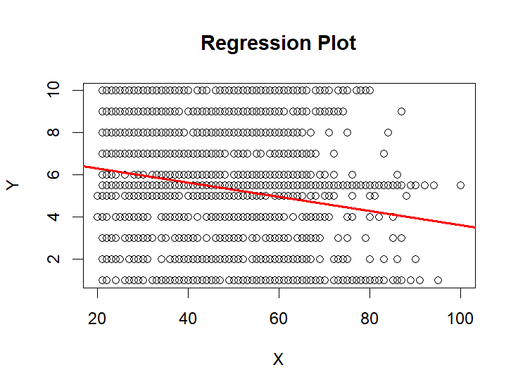
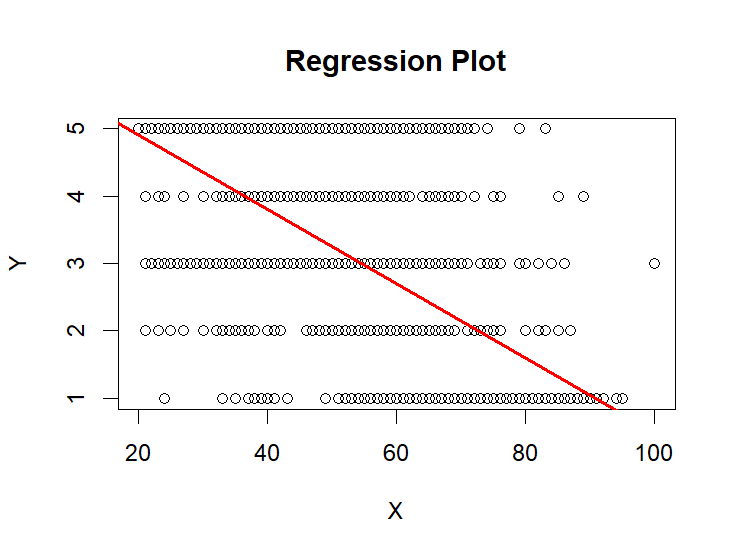
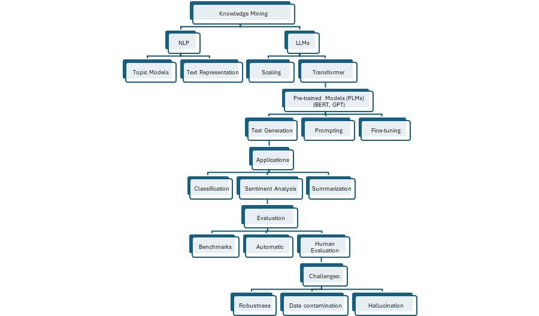

---

# Assignment 3: ML exercise

library(haven)\
\
TEDS_2016 \<- read_stata("https://github.com/datageneration/home/blob/master/DataProgramming/data/TEDS_2016.dta?raw=true")

\`\`\`{r}\
names(TEDS_2016)\
head(TEDS_2016)\
\`\`\`

\`\`\`{r}\
model \<- lm(income \~ age + edu , data = TEDS_2016)\
summary(model)\
\`\`\`

\`\`\`{r}\
regplot(TEDS_2016\$age, TEDS_2016\$income)

\`\`\`{r}\
regplot(TEDS_2016\$age, TEDS_2016\$edu)

The problem was that as the model regplot did not allow me to add two independent variables, I think it is not a proper regression model for this question.

It seems that we should use another regression model.

---

# Prepare for class 8:

## Summary of findings

After creation of Natural Language Processing (NLP) and Large Language Models (LLMs) the field of knowledge mining progressed. Early approaches based on statistical models have been replaced by neural and transformer-based architectures, which help to have more efficient extraction of meaningful patterns from large scale unstructured text data.

Pre-trained language models (PLMs) such as BERT and GPT introduce a paradigm shift by leveraging large corpora through unsupervised learning. These models improved performance across various NLP tasks including text classification, sentiment analysis, and information extraction. With the emergence of LLMs, scaling model parameters and training data has further enhanced their capabilities to capture complex linguistic and semantic relationships.

LLMs perform tasks without task specific training and make them highly flexible tools for knowledge discovery. In this case prompting techniques and in-context learning (ICL) help it to provide this ability.

Evaluation of LLMs has become an essential area of research, as it focuses on both performance of tasks and social impacts. There are some metrics like helpfulness, honesty and harmlessness. And there are some methods to find performance in tasks like sentiment analysis and text classification. And LLMs still have limitation on reasoning tasks like natural language inference.

Overall, NLP and LLMs have changed the knowledge mining by providing scalable automation and context aware extraction of textual data, while many researchers try to improve reliability, interpretability, and evaluation frameworks for them.

Resources:

a.  Zhao, Wayne Xin, Kun Zhou, Junyi Li, Tianyi Tang, Xiaolei Wang, Yupeng Hou, Yingqian Min et al. 2023. “A survey of large language models.” arXiv preprint arXiv:2303.18223 1, no. 2.
b.  Chang, Yupeng, Xu Wang, Jindong Wang, Yuan Wu, Linyi Yang, Kaijie Zhu, Hao Chen et al. 2024. “A survey on evaluation of large language models.” ACM transactions on intelligent systems and technology 15, no. 31-45.
c.  Min, Bonan, Hayley Ross, Elior Sulem, Amir Pouran Ben Veyseh, Thien Huu Nguyen, Oscar Sainz, Eneko Agirre, Ilana Heintz, and Dan Roth. 2023. “Recent advances in natural language processing via large pre-trained language models: A survey.” ACM Computing Surveys 56, no. 2: 1-40.

## Key concepts: 

-   Large Language Models (LLMs)

-   Pre-trained Language Models (PLMs)

-   Transformer Architecture

-   Scaling Laws

-   Prompting & In-Context Learning (ICL)

-   Reinforcement Learning from Human Feedback (RLHF)

-   Knowledge Mining

-   Text Representation (BOW, Embeddings)

-   Evaluation Methods (automatic & human evaluation)

-   Hallucination & Safety Issues

-   Benchmarking & Robustness

-   NLP Paradigms:

    -   Pre-train & Fine-tune

    -   Prompt-based Learning

    -    NLP as Text Generation

## Diagram

