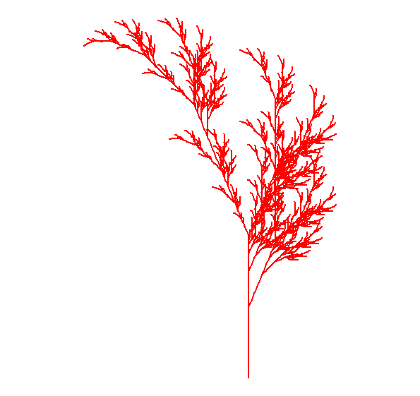

# Assignment 1- 9/16/26

### Brief of Francis J Anscombe:

He analysed data sets and designed the graphed in 4 figures. The first graph is belonging to the data set 1., and it was a straight line among data showing the regression and it seems correct. In data sent 2 figure, Y has a smooth curved relation with x and there is little residual variability. In Figure 3 is more like a figure one but there is an observation lied close to the straight line and one observation is far from the line ( an outlier). Figure 4 is like figure 1 showing data forming well. all information about the slope of the regression line shows that we need to consider the mapping of the regression and residuals while we are considering the math and equations. Figures are as important as mathematical process as we can see the outliers in the maps easier and faster than the math.

{fig-align="center" width="287"}

# Assignment 2- 9/23/26

### Brief of Journalism in the age of Data

Geoff McGhee searched for finding a way to visualize data as an important part of journalism and using data visualization to transfer information and story to other people. Journalism and scientific visualization are both presenting easier picture of complex data, but with different goals. In Journalism thefocus is on the comminication and story telling part of the report with interactive features, the benefit of this approach is that even somebodu without statistical knowledge can understand the pattern. Scientific visualization focus more on accuracy, transparency and productivity. So there is a trade off from less understandable to more sophisticated.

### Merrele practice:

Comment:Examples of the use of standard high-level plotting functions.In each case, extra output is also added using low-level plotting functions.

par(mfrow=c(3, 2))

Scatterplot x \<- c(0.5, 2, 4, 8, 12, 16) y1 \<- c(1, 1.3, 1.9, 3.4, 3.9, 4.8) y2 \<- c(4, .8, .5, .45, .4, .3) par(las=1, mar=c(4, 4, 2, 4), cex=.7) plot.new() plot.window(range(x), c(0, 6)) lines(x, y1) lines(x, y2) points(x, y1, pch=16, cex=2) points(x, y2, pch=21, bg="white", cex=2) par(col="gray50", fg="gray50", col.axis="gray50") axis(1, at=seq(0, 16, 4)) axis(2, at=seq(0, 6, 2)) axis(4, at=seq(0, 6, 2)) box(bty="u") mtext("Travel Time (s)", side=1, line=2, cex=0.8) mtext("Responses per Travel", side=2, line=2, las=0, cex=0.8) mtext("Responses per Second", side=4, line=2, las=0, cex=0.8) text(4, 5, "Bird 131") par(mar=c(5.1, 4.1, 4.1, 2.1), col="black", fg="black", col.axis="black")

Histogram- Random data Y \<- rnorm(50) Make sure no Y exceed \[-3.5, 3.5\] Y\[Y \< -3.5 \| Y \> 3.5\] \<- NA x \<- seq(-3.5, 3.5, .1) dn \<- dnorm(x) par(mar=c(4.5, 4.1, 3.1, 0)) hist(Y, breaks=seq(-3.5, 3.5), ylim=c(0, 0.5), col="gray80", freq=FALSE) lines(x, dnorm(x), lwd=2) par(mar=c(5.1, 4.1, 4.1, 2.1))

Barplot- Modified from example(barplot) par(mar=c(2, 3.1, 2, 2.1)) midpts \<- barplot(VADeaths, col=gray(0.1 + seq(1, 9, 2)/11), names=rep("", 4)) mtext(sub(" ", "\n", colnames(VADeaths)), at=midpts, side=1, line=0.5, cex=0.5) text(rep(midpts, each=5), apply(VADeaths, 2, cumsum) - VADeaths/2, VADeaths, col=rep(c("white", "black"), times=3:2), cex=0.8) par(mar=c(5.1, 4.1, 4.1, 2.1))

Boxplot- Modified example(boxplot) - itself from suggestion by Roger Bivand par(mar=c(3, 4.1, 2, 0)) boxplot(len \~ dose, data = ToothGrowth, boxwex = 0.25, at = 1:3 - 0.2, subset= supp == "VC", col="white", xlab="", ylab="tooth length", ylim=c(0,35)) mtext("Vitamin C dose (mg)", side=1, line=2.5, cex=0.8) boxplot(len \~ dose, data = ToothGrowth, add = TRUE, boxwex = 0.25, at = 1:3 + 0.2,

         subset= supp == "OJ")
 legend(1.5, 9, c("Ascorbic acid", "Orange juice"), 
        fill = c("white", "gray"), 
        bty="n")
```

par(mar=c(5.1, 4.1, 4.1, 2.1))

Persp- Almost exactly example(persp) x \<- seq(-10, 10, length= 30) y \<- x f \<- function(x,y) { r \<- sqrt(x^2+y^2); 10 \* sin(r)/r } z \<- outer(x, y, f) z\[is.na(z)\] \<- 1 0.5 to include z axis label par(mar=c(0, 0.5, 0, 0), lwd=0.5) persp(x, y, z, theta = 30, phi = 30,

```         
       expand = 0.5)
```

par(mar=c(5.1, 4.1, 4.1, 2.1), lwd=1)

Piechart- Example 4 from help(pie) par(mar=c(0, 2, 1, 2), xpd=FALSE, cex=0.5) pie.sales \<- c(0.12, 0.3, 0.26, 0.16, 0.04, 0.12) names(pie.sales) \<- c("Blueberry", "Cherry", "Apple", "Boston Cream", "Other", "Vanilla") pie(pie.sales, col = gray(seq(0.3,1.0,length=6)))


Hist() creates a whole plot lines() adds something to the existing plot

when I wanted to read the excel sheet as it had several sheets I ran this code to see the name of sheets excel_sheets("C:/Users/smvic/Downloads/HPI2_2026.xlsx") then I wanted to read the "all countries" sheet that I ran this code: hpi \<- read_excel( "C:/Users/smvic/Downloads/HPI2_2026.xlsx", sheet = "1. All countries" ) then I check the headings title: head(hpi) axis() controls the tick marks and labels displayed on a specific plot axis.


library(readxl)

```r
library(readxl)

--- Check sheets and load data ---
excel_sheets("C:/Users/smvic/Downloads/HPI2_2026.xlsx")

hpi <- read_excel(
  "C:/Users/smvic/Downloads/HPI2_2026.xlsx", 
  sheet = "1. All countries"
)
head(hpi)

hpi_all <- read_excel(
  "C:/Users/smvic/Downloads/HPI2_2026.xlsx",
  sheet = "All Data",
  range = "A2:T2451"
)

names(hpi_all)
sort(unique(hpi_all$Year))

--- Filter to 2025 ---
hpi_2025 <- subset(hpi_all, Year == 2025)
dim(hpi_2025)
head(hpi_2025)
length(unique(hpi_2025$Country))

--- Scatterplot: Life Expectancy vs HPI ---
par(mar = c(5, 5, 3, 2))
plot(
  hpi_2025$`Life Expectancy`,
  hpi_2025$HPI,
  xlab = "Life Expectancy",
  ylab = "Happy Planet Index",
  main = "Life Expectancy and HPI, 2025"
)
box()

--- Histogram of HPI scores ---
hist(
  hpi_2025$HPI,
  main = "Distribution of HPI Scores, 2025",
  xlab = "Happy Planet Index",
  ylab = "Number of Countries"
)

--- Boxplot of HPI ---
boxplot(
  hpi_2025$HPI,
  main = "HPI Distribution, 2025",
  ylab = "Happy Planet Index"
)

--- Pie chart: Ecological Footprint category ---
footprint_counts <- table(hpi_2025$`Footprint category`)
names(footprint_counts) <- paste("Category", names(footprint_counts))
pie(
  footprint_counts,
  main = "Countries by Ecological Footprint Category, 2025"
)

--- 3D perspective surface (demo plot) ---
x <- seq(-10, 10, length.out = 30)
y <- seq(-10, 10, length.out = 30)
z <- outer(x, y, function(x, y) sin(sqrt(x^2 + y^2)))

persp(
  x, y, z,
  theta = 30,
  phi = 25,
  expand = 0.7,
  xlab = "X",
  ylab = "Y",
  zlab = "Z",
  main = "3D Perspective Surface"
)
```