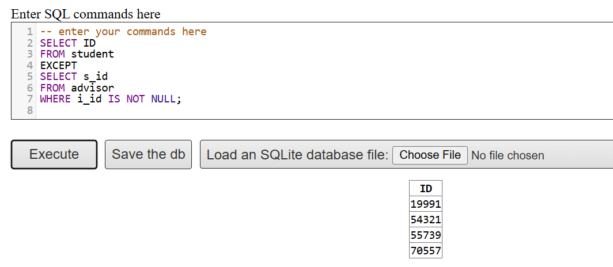
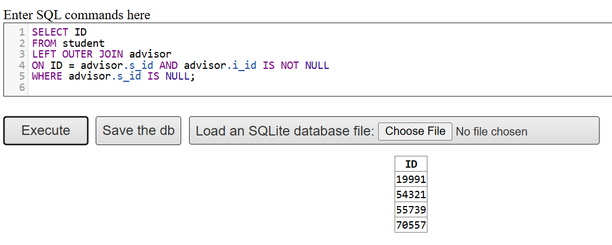
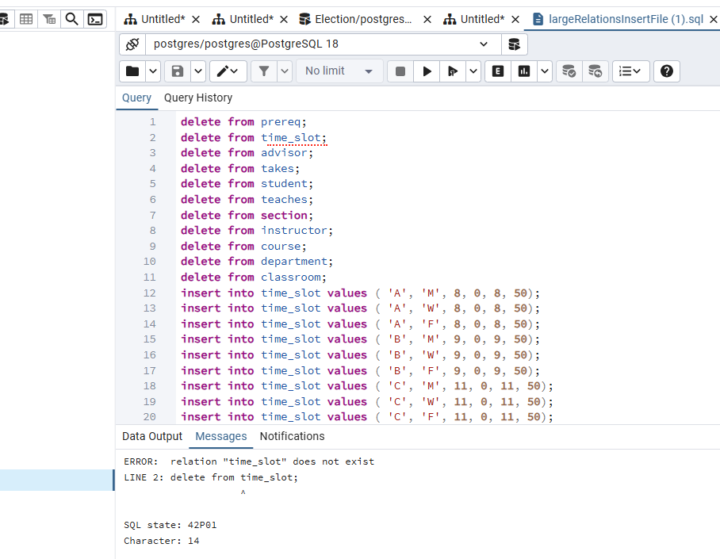
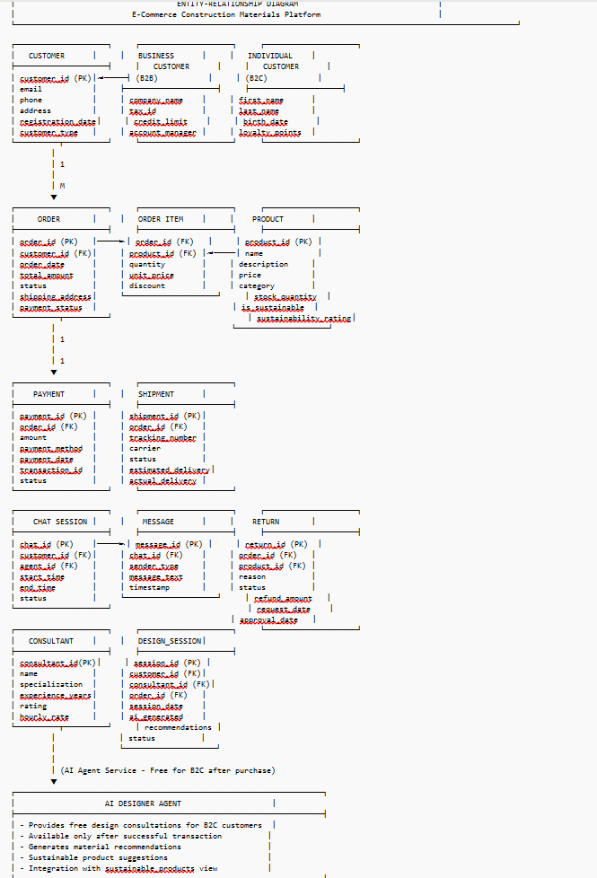

# Assignment 3 Question 1

Open the Online SQL interpreter (https://www.db-book.com/university-lab-dir/sqljs.html) 2. Write SQL codes to get a list of: i. Students IDs (hint: from the takes relation)

## 

ID 00128 00128 12345 12345 12345 12345 19991 23121 44553 45678 45678 45678 54321 54321 55739 76543 76543 76653 98765 98765 98988 98988

------------------------------------------------------------------------

ii. Instructors

Answer:

select name from instructor

name Srinivasan Wu Mozart Einstein El Said Gold Katz Califieri Singh Crick Brandt Kim

------------------------------------------------------------------------

iii. Departments Answer:

select dept_name from department

dept_name Biology Comp. Sci. Elec. Eng. Finance History Music Physics

------------------------------------------------------------------------

3.  Write in SQL codes to do following queries:

<!-- -->

i.  Find the ID and name of each student who has taken at least one Comp. Sci. course; make sure there are no duplicate names in the result.

ID name 00128 Zhang 12345 Shankar 45678 Levy 54321 Williams 76543 Brown 98765 Bourikas ---

ii. Add grades to the list

ID name grade 00128 Zhang A 00128 Zhang A- 12345 Shankar C 12345 Shankar A 45678 Levy F 45678 Levy B+ 45678 Levy B 54321 Williams A- 54321 Williams B+ 76543 Brown A 98765 Bourikas C- 98765 Bourikas B ---

iii. Find the ID and name of each student who has not taken any course offered before 2017.

ID name 00128 Zhang 12345 Shankar 19991 Brandt 23121 Chavez 44553 Peltier 45678 Levy 54321 Williams 55739 Sanchez 70557 Snow 76543 Brown 76653 Aoi 98765 Bourikas 98988 Tanaka

------------------------------------------------------------------------

iv. For each department, find the maximum salary of instructors in that department. You may assume that every department has at least one instructor. dept_name max_salary Biology 72000 Comp. Sci. 92000 Elec. Eng. 80000 Finance 90000 History 62000 Music 40000 Physics 95000

------------------------------------------------------------------------

------------------------------------------------------------------------

vi. Add names to the list

name salary Mozart 40000 ---

4.  Find instructor (with name and ID) who has never given an A grade in any course she or he has taught. (Instructors who have never taught a course trivially satisfy this condition.)

ID name 12121 Wu 15151 Mozart 22222 Einstein 32343 El Said 33456 Gold 45565 Katz 58583 Califieri 76543 Singh 98345 Kim

------------------------------------------------------------------------

# **Assignment5:**

------------------------------------------------------------------------

Q1: disconnected graph: is like two different team having their own database like HR team having database of employees and financial team having database of invoices.

------------------------------------------------------------------------

Q2: cyclical graph is like a person who send request for having a software access, the access is sent to another team to review, they send it to the requester manager for approval then they provide the access and send the software access to requester. Finally the person install the software.

------------------------------------------------------------------------

Q3: I think we do not need to make all of our entities strong and when a weak entity works and answer the requirement is good enough so it depends on the priorities and requirements that we decide for variables not just making all entities strong.

------------------------------------------------------------------------

------------------------------------------------------------------------

Q4:

a\)

------------------------------------------------------------------------

i\)

Select e.id and e.name

from employee as e, works as w, company as c, manages as m

Where e.id = w.id

And w.company_name = c.company_name,

And e.city=c.city

------------------------------------------------------------------------

ii\)

Select e.id and e.name

from employee as e, works as w, company as c, manages as m

Where e.id = m.id

And manager_id=m.id

And e.city=m.city

And e.street=m.street

------------------------------------------------------------------------

iii\)

Select e.id and e.name

from employee as e, works as w, company as c, manages as m

Where e.id = w.id

And w.salary\> s.salary,

s.salary = Average_salary of all employees at c.id

------------------------------------------------------------------------

b\)

{width="419"}

# Assignment 6

Look up websites containing the following data representations:

-   

-   Using JSON

-   Using XML Analyze the websites in terms of structure and composition. Name the technology/methods use for creating the web database.

I selected the website of Flagstar bank for this question. I asked Chat GPT where can I find JSON then I found it then I saw Json codes there.

I clicked on www.flagstar.com.json?t=1

I paste part of the larg codes in that page of JSON structure:

```         
      "criteria": "click",          
      "comparison": "any"  }  ] },    
      "resources": [      
      {         
      "resource_id": "49583",      
      "resource_type": "goal"
```

I did not find any XML on this website

but I previously used XML in power automate to call the power app link and creating a token to send in the outlook mailbox and it was as like as this

"<br><br><a href='https://apps.powerapps.com/play/YOUR_APP_ID?tenantId=YOUR_TENANT_ID&token=" & locToken & "'>Click here to start the survey</a>", {Importance: "High"}

in the website I saw a great and nice structure of coding and it was easy to understand to some extent, while when I used XML I did not understood why I should use the term 'br\>' several times at the beginning of sentences or at the end of it, so it was complicated to understand and following the codes, for me.

------------------------------------------------------------------------

2.  SQL exercise:

<!-- -->

i.  Express the following query in SQL using no subqueries and no set operations. (Hint: left outer join) select ID from student except select s id from advisor where i ID is not null
ii. Using the university schema, write an SQL query to find the names and IDs of those instructors who teach every course taught in his or her department (i.e., every course that appears in the course relation with the instructor’s department name). Order result by name

------------------------------------------------------------------------

answer:



SELECT ID

FROM student

LEFT OUTER JOIN advisor

ON ID = advisor.s_id AND advisor.i_id IS NOT NULL

WHERE advisor.s_id IS NULL;



-   SELECT instructor.ID, instructor.name

-   FROM instructor

-   WHERE NOT EXISTS(

-   SELECT course.course_id

-   FROM course

-   WHERE course.dept_name=instructor.dept_name

it did not works

------------------------------------------------------------------------

question 3



## prepare for class 8

the business that I asked Deepseek for creating an ERdiagram for it

create ER Diagram for this business I have an ecommerce website for selling construction materials. I have two type of customers. B2B and B2C. I have some section for sustainable houses and wants to sell those items to its customers who cares about environment and sustainability. I have a customer service online section to chat with customers and return and logistic section for delivering products. also I have the section for payment for procucts that people buy from my website that way they can pay the fees. also I have some section for consultants and designers to help people to have idea what should they buy. the designer section is completely AI agent service and it is free for B2C customers (for house owners who shop from us and it will be available after successful transaction.



the error is that I do not see a star schema in the diagram. it did not connected some of tables there and it missed the connection of key items

# Assignment 7

part1

This is a standard relational schema for a university database, often used in database system textbooks (like Silberschatz, Korth, and Sudarshan). It effectively captures the relationships between departments, students, instructors, and the courses they offer.

Here is a breakdown of the core components and how they connect:

### **1. Core Entities**

-   **Location:** `classroom` defines where classes happen.

-   **Organization:** `department` acts as the hub, linking students, instructors, and courses.

-   **People:** `student` and `instructor` contain basic profile information.

-   **Curriculum:** `course` defines the subject, while `section` represents a specific offering of that course (time/place).

### **2. Key Relationships**

The schema uses several **Foreign Keys** to maintain referential integrity:

|  |  |  |
|----|----|----|
| **Table** | **Links to...** | **Purpose** |
| **course** | `department` | Associates a course with its organizing department. |
| **section** | `course` & `classroom` | Links a specific class to its parent course and its physical location. |
| **teaches** | `instructor` & `section` | Maps which instructor is teaching which specific class section. |
| **takes** | `student` & `section` | Tracks student enrollment and their final grades. |
| **advisor** | `student` & `instructor` | A many-to-one mapping of students to their faculty advisors. |
| **prereq** | `course` (Self-referential) | Defines which courses must be taken before others. |

### **3. Integrity Constraints**

You've included several important SQL constraints:

-   **`check` clauses:** Ensure data validity (e.g., `budget > 0`, `credits > 0`, and specific semester names).

-   **`on delete set null`:** If a department or classroom is deleted, the referencing record remains but the link is cleared.

-   **`on delete cascade`:** If a student or course is deleted, all related enrollment/teaching records are automatically removed to prevent orphaned data.

**Are you working on specific queries for your "Query Evaluation" lab?** I can help you write the SQL for data retrieval or explain how a query optimizer might handle joins across these tables.

## Gemini said

Here are the SQL queries based on the schema provided for your AI Lab. These queries utilize standard SQL features like aggregations, joins, correlated subqueries, and window functions.

### **Query 1 — Aggregation**

To find the enrollments and average student credits per department, we join the `student` table with the `takes` table.

**SQL**

```         
SELECT      dept_name,      COUNT(*) AS total_enrollments,      AVG(tot_cred) AS avg_student_credits FROM student JOIN takes ON student.ID = takes.ID GROUP BY dept_name ORDER BY total_enrollments DESC; 
```

### **Query 2 — Multi-Table Join**

This query requires joining `instructor`, `teaches`, and `takes` to count students per section, filtering with a `HAVING` clause for the enrollment threshold.

**SQL**

```         
SELECT      i.name,      i.dept_name,      t.course_id,      t.semester,      t.year,      COUNT(tk.ID) AS student_count FROM instructor i JOIN teaches t ON i.ID = t.ID JOIN takes tk ON      t.course_id = tk.course_id AND      t.sec_id = tk.sec_id AND      t.semester = tk.semester AND      t.year = tk.year GROUP BY i.ID, i.name, i.dept_name, t.course_id, t.sec_id, t.semester, t.year HAVING COUNT(tk.ID) >= 10; 
```

### **Query 3 — Correlated Subquery**

The logic here is to find courses where there is **no** section that lacks an 'A' student.

**SQL**

```         
SELECT title FROM course c WHERE NOT EXISTS (     SELECT 1      FROM section s      WHERE s.course_id = c.course_id     AND NOT EXISTS (         SELECT 1          FROM takes tk          WHERE tk.course_id = s.course_id          AND tk.sec_id = s.sec_id          AND tk.semester = s.semester          AND tk.year = s.year          AND tk.grade = 'A'     ) ); 
```

### **Query 4 — Window Function**

We use `RANK()` to order by salary and `PERCENT_RANK()` to find the relative standing within each department.

**SQL**

```         
SELECT      name,      dept_name,      salary,     RANK() OVER (PARTITION BY dept_name ORDER BY salary DESC) AS dept_salary_rank,     PERCENT_RANK() OVER (PARTITION BY dept_name ORDER BY salary DESC) AS salary_percentile FROM instructor; 
```

### **Query 5 — Complex Query**

This combines an aggregation filter (for the 3 departments) with a subquery to ensure the student hasn't taken their advisor's class.

**SQL**

```         
SELECT s.name FROM student s JOIN takes tk ON s.ID = tk.ID JOIN course c ON tk.course_id = c.course_id WHERE s.ID NOT IN (     -- Subquery: Students who HAVE taken a course with their advisor     SELECT a.s_ID     FROM advisor a     JOIN teaches t ON a.i_ID = t.ID     JOIN takes tk2 ON          t.course_id = tk2.course_id AND          t.sec_id = tk2.sec_id AND          t.semester = tk2.semester AND          t.year = tk2.year     WHERE tk2.ID = a.s_ID ) GROUP BY s.ID, s.name HAVING COUNT(DISTINCT c.dept_name) >= 3; 
```

**Would you like me to explain the logic behind Query 5's "NOT IN" clause or show**

This is the answer that I received form Gemini after I pased the codes and queries from PDF file I did not write a prompt I just used the pdf file of class. then I pased it here.
