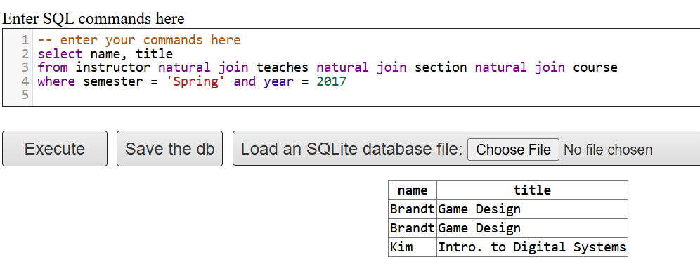

\# Assignment 3\
\
\## Question 1

Open the Online SQL interpreter (https://www.db-book.com/university-lab-dir/sqljs.html) 2. Write SQL codes to get a list of: i. Students IDs (hint: from the takes relation)

## \### Answer {#sec-answer}

ID 00128 00128 12345 12345 12345 12345 19991 23121 44553 45678 45678 45678 54321 54321 55739 76543 76543 76653 98765 98765 98988 98988

------------------------------------------------------------------------

ii. Instructors

Answer:

select name from instructor

name Srinivasan Wu Mozart Einstein El Said Gold Katz Califieri Singh Crick Brandt Kim

------------------------------------------------------------------------

iii. Departments Answer:

select dept_name from department

dept_name Biology Comp. Sci. Elec. Eng. Finance History Music Physics

------------------------------------------------------------------------

3.  Write in SQL codes to do following queries:

<!-- -->

i.  Find the ID and name of each student who has taken at least one Comp. Sci. course; make sure there are no duplicate names in the result.

ID name 00128 Zhang 12345 Shankar 45678 Levy 54321 Williams 76543 Brown 98765 Bourikas ---

ii. Add grades to the list

ID name grade 00128 Zhang A 00128 Zhang A- 12345 Shankar C 12345 Shankar A 45678 Levy F 45678 Levy B+ 45678 Levy B 54321 Williams A- 54321 Williams B+ 76543 Brown A 98765 Bourikas C- 98765 Bourikas B ---

iii. Find the ID and name of each student who has not taken any course offered before 2017.

ID name 00128 Zhang 12345 Shankar 19991 Brandt 23121 Chavez 44553 Peltier 45678 Levy 54321 Williams 55739 Sanchez 70557 Snow 76543 Brown 76653 Aoi 98765 Bourikas 98988 Tanaka

------------------------------------------------------------------------

iv. For each department, find the maximum salary of instructors in that department. You may assume that every department has at least one instructor. dept_name max_salary Biology 72000 Comp. Sci. 92000 Elec. Eng. 80000 Finance 90000 History 62000 Music 40000 Physics 95000

---

---

vi. Add names to the list

name salary Mozart 40000 ---

4.  Find instructor (with name and ID) who has never given an A grade in any course she or he has taught. (Instructors who have never taught a course trivially satisfy this condition.)

ID name 12121 Wu 15151 Mozart 22222 Einstein 32343 El Said 33456 Gold 45565 Katz 58583 Califieri 76543 Singh 98345 Kim

------------------------------------------------------------------------

**#Assignment5:**

------------------------------------------------------------------------

Q1: disconnected graph: is like two different team having their own database like HR team having database of employees and financial team having database of invoices.

------------------------------------------------------------------------

Q2: cyclical graph is like a person who send request for having a software access, the access is sent to another team to review, they send it to the requester manager for approval then they provide the access and send the software access to requester. Finally the person install the software.

------------------------------------------------------------------------

Q3: I think we do not need to make all of our entities strong and when a weak entity works and answer the requirement is good enough so it depends on the priorities and requirements that we decide for variables not just making all entities strong.

---

------------------------------------------------------------------------

Q4:

a\)

---

i\)

Select e.id and e.name

from employee as e, works as w, company as c, manages as m

Where e.id = w.id

And w.company_name = c.company_name,

And e.city=c.city

---

ii\)

Select e.id and e.name

from employee as e, works as w, company as c, manages as m

Where e.id = m.id

And manager_id=m.id

And e.city=m.city

And e.street=m.street

---

iii\)

Select e.id and e.name

from employee as e, works as w, company as c, manages as m

Where e.id = w.id

And w.salary\> s.salary,

s.salary = Average_salary of all employees at c.id

---

b\)

{width="419"}
