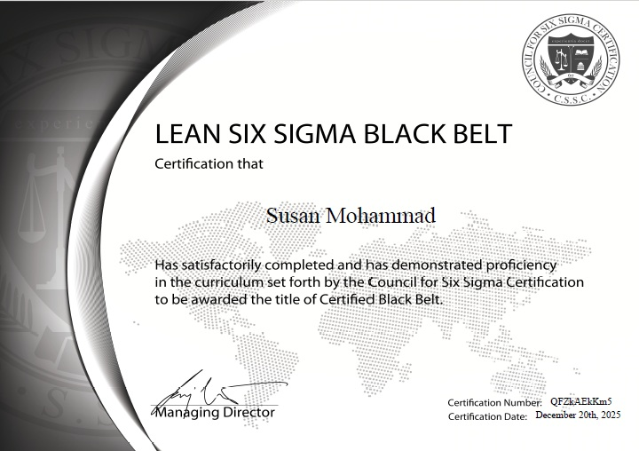

```{=html}
<div class="hero">
<canvas id="graph"></canvas>
<div class="hero-content">
<h1>I turn process expertise into AI-powered systems.</h1>
<div class="role-line"><span id="typed"></span><span class="cursor">|</span></div>
<p class="bio">
<strong>7+ years</strong> driving process transformation, continuous improvement, and operational efficiency across tech and banking — cutting manual coordination effort by <strong>90%</strong> through workflow automation. Now building the ML models, LLM pipelines, and vector databases that solve complex business problems with code.
</p>
<div class="cta-row">
<a class="btn primary" href="#featured-research">View Research</a>
<a class="btn" href="#featured-apps">View Applications</a>
</div>
</div>
</div>

<section id="featured-research">
<div class="section-label">Featured Research</div>
<h2>Legislative Text Analysis</h2>

<div class="project-card featured-card">
<div class="project-body">
<div class="tags">
<span class="tag">NLP</span>
<span class="tag">TF-IDF</span>
<span class="tag">LDA Topic Modeling</span>
<span class="tag">Wordfish Scaling</span>
<span class="tag">LLM Tagging</span>
<span class="tag">R</span>
</div>
<h3>Voting Bills Analysis Across Red, Blue &amp; Purple States</h3>
<p>
Political text mining project analyzing state-level voting legislation across the U.S. using Natural Language Processing and LLM classification. Parsed 83 legislative bills and 51 supporting research documents to discover policy themes, language patterns, and ideological shifts. Evaluated automated tagging rigor with human-in-the-loop agreement (Cohen's &kappa; = 0.831).
</p>
<div class="project-links">
<a href="voting-bills-analysis.qmd">Read Full Methodology &amp; Code ↗</a>
<a href="https://github.com/susanmohammadk22" target="_blank" rel="noopener noreferrer">GitHub Repo ↗</a>
</div>
</div>
</div>
</section>

<section id="featured-apps">
<div class="section-label">Selected Work</div>
<h2>AI &amp; Data Applications</h2>

<div class="projects-grid">

<div class="project-card">
<div class="project-body">
<h3>QIntel — Live Event Q&amp;A Intelligence</h3>
<p>Real-time audience interaction engine backed by a star-schema vector database pipeline. Detects duplicate questions via semantic embeddings, classifies topics, and suggests live answers.</p>
<div class="tags">
<span class="tag">R + Shiny</span>
<span class="tag">Embeddings</span>
<span class="tag">PostgreSQL</span>
</div>
<div class="project-links">
<a href="https://qevent.shinyapps.io/qevent_app/" target="_blank" rel="noopener noreferrer">Live Demo ↗</a>
<a href="Final-Project.pdf" target="_blank" rel="noopener noreferrer">Report ↗</a>
</div>
</div>
</div>

<div class="project-card">
<div class="project-body">
<h3>Python Quiz App with AI Tutor</h3>
<p>Interactive assessment tool built with FastAPI and SQLite. Uses a local LLM (Ollama + DeepSeek-Coder) to provide plain-language explanations for wrong answers and dynamically generate new questions.</p>
<div class="tags">
<span class="tag">FastAPI</span>
<span class="tag">Local LLM</span>
<span class="tag">SQLite</span>
</div>
<div class="project-links">
<a href="https://python-quiz-app-tzkf.onrender.com/" target="_blank" rel="noopener noreferrer">Live Demo ↗</a>
<a href="https://github.com/susanmohammadk22/Python-Quiz-App" target="_blank" rel="noopener noreferrer">GitHub ↗</a>
</div>
</div>
</div>

<div class="project-card full-width">
<div class="project-body">
<h3>Flight Delay Risk Prediction (DFW Airport Analysis)</h3>
<p>Predictive analytics pipeline built for the American Airlines / UTD Hackathon. Connects directly to live weather APIs via an ETL data pipeline, flagging high-risk airport pairs using Random Forest and Lasso regression models.</p>
<div class="tags">
<span class="tag">R</span>
<span class="tag">Random Forest</span>
<span class="tag">Lasso Regression</span>
<span class="tag">ETL</span>
</div>
<div class="project-links">
<a href="https://github.com/susanmohammadk22/airline-weather-risk-analysis" target="_blank" rel="noopener noreferrer">GitHub Repository &amp; Code ↗</a>
</div>
</div>
</div>

</div>
</section>

<section>
<div class="section-label">Career</div>
<h2>Experience</h2>
<div class="exp-list">
<div class="exp-row">
<div class="exp-meta"><span class="role">Process Transformation Engineer</span>Comerica Bank<br>Feb 2025 – Present</div>
<div class="exp-body"><p>Supported end-to-end process transformation for restitution project; built Power Platform automations that reduced manual coordination effort by 90% and provided real-time operational visibility to leadership. Contributed to a data migration project merging processes between Comerica Bank and Fifth Third Bank.</p></div>
</div>
<div class="exp-row">
<div class="exp-meta"><span class="role">Continuous Improvement Expert</span>Snapp (100M+ users)<br>Nov 2020 – Dec 2023</div>
<div class="exp-body"><p>Led a Face ID authentication initiative—presented the business case to executive leadership—cutting verification steps and improving experience ~45%; redesigned regional support workflows, increasing team productivity by 35%.</p></div>
</div>
<div class="exp-row">
<div class="exp-meta"><span class="role">Process Excellence &amp; Governance</span>Hyper-Me · Shatel<br>Jun 2015 – Nov 2020</div>
<div class="exp-body"><p>Centralized process documentation, SOPs, and governance frameworks across two organizations, reducing redundancy 30% and accelerating onboarding 25% while achieving 80% adoption on process rollouts.</p></div>
</div>
</div>
</section>

<section id="certifications">
<div class="section-label">Credentials</div>
<h2>Certifications &amp; Licenses</h2>

<div class="projects-grid">

<!-- Lean Six Sigma Black Belt Card -->
<div class="project-card cert-card">
<div class="cert-image-container">
<a href="black-belt.pdf" target="_blank" rel="noopener noreferrer">

</a>
</div>
<div class="project-body">
<h3>Lean Six Sigma Black Belt</h3>
<p class="cert-issuer">Council for Six Sigma Certification (CSSC)</p>
<div class="tags">
<span class="tag">Process Excellence</span>
<span class="tag">DMAIC</span>
</div>
<div class="project-links">
<a href="black-belt.pdf" target="_blank" rel="noopener noreferrer">View Original PDF ↗</a>
</div>
</div>
</div>

<!-- iGrafx Process Design Administration Card -->
<div class="project-card cert-card">
<div class="cert-image-container">
<a href="igrafx-cert.pdf" target="_blank" rel="noopener noreferrer">

</a>
</div>
<div class="project-body">
<h3>Process Design Administration (Level 100)</h3>
<p class="cert-issuer">iGrafx University · Process360 Live</p>
<div class="tags">
<span class="tag">Process Modeling</span>
<span class="tag">BPMN</span>
<span class="tag">Workflow Design</span>
</div>
<div class="project-links">
<a href="igrafx-cert.pdf" target="_blank" rel="noopener noreferrer">View Original PDF ↗</a>
</div>
</div>
</div>

</div>
</section>

<section>
<div class="section-label">Toolkit</div>
<h2>Skills &amp; Capabilities</h2>
<div class="skills-grid">
<div class="skill-chip">Python</div>
<div class="skill-chip">R</div>
<div class="skill-chip">SQL</div>
<div class="skill-chip">LLMs (Ollama)</div>
<div class="skill-chip">NLP / TF-IDF</div>
<div class="skill-chip">Random Forest</div>
<div class="skill-chip">Lasso Regression</div>
<div class="skill-chip">Shiny</div>
<div class="skill-chip">PostgreSQL</div>
<div class="skill-chip">SQLite</div>
<div class="skill-chip">Process Mapping</div>
<div class="skill-chip">Lean Six Sigma Black Belt</div>
<div class="skill-chip">Econometrics</div>
</div>
</section>

<script>
const roles = ["Process Transformation Engineer", "AI & ML Builder", "Continuous Improvement Expert"];
const typedEl = document.getElementById('typed');
let r = 0, c = 0, deleting = false;

function tick(){
if (!typedEl) return;
const word = roles[r];
typedEl.textContent = deleting ? word.slice(0, c--) : word.slice(0, c++);
if(!deleting && c === word.length + 1){ deleting = true; setTimeout(tick, 1200); return; }
if(deleting && c === 0){ deleting = false; r = (r+1) % roles.length; }
setTimeout(tick, deleting ? 40 : 85);
}
tick();

const canvas = document.getElementById('graph');
if (canvas) {
const ctx = canvas.getContext('2d');
function resize(){
canvas.width = canvas.parentElement.offsetWidth;
canvas.height = canvas.parentElement.offsetHeight;
}
resize();
window.addEventListener('resize', resize);

const N = 40;
const pts = Array.from({length:N}, () => ({
x: Math.random()*canvas.width,
y: Math.random()*canvas.height,
vx: (Math.random()-0.5)*0.25,
vy: (Math.random()-0.5)*0.25
}));

function draw(){
ctx.clearRect(0, 0, canvas.width, canvas.height);

for(const p of pts){
p.x += p.vx;
p.y += p.vy;
if(p.x < 0 || p.x > canvas.width) p.vx *= -1;
if(p.y < 0 || p.y > canvas.height) p.vy *= -1;
}

for(let i = 0; i < N; i++){
for(let j = i + 1; j < N; j++){
const dx = pts[i].x - pts[j].x;
const dy = pts[i].y - pts[j].y;
const d = Math.sqrt(dx * dx + dy * dy);
if(d < 140){
ctx.strokeStyle = `rgba(45,212,191,${0.15 * (1 - d / 140)})`;
ctx.beginPath();
ctx.moveTo(pts[i].x, pts[i].y);
ctx.lineTo(pts[j].x, pts[j].y);
ctx.stroke();
}
}
}

for(const p of pts){
ctx.fillStyle = 'rgba(242,166,90,0.7)';
ctx.beginPath();
ctx.arc(p.x, p.y, 2, 0, Math.PI * 2);
ctx.fill();
}

requestAnimationFrame(draw);
}
draw();
}
</script>