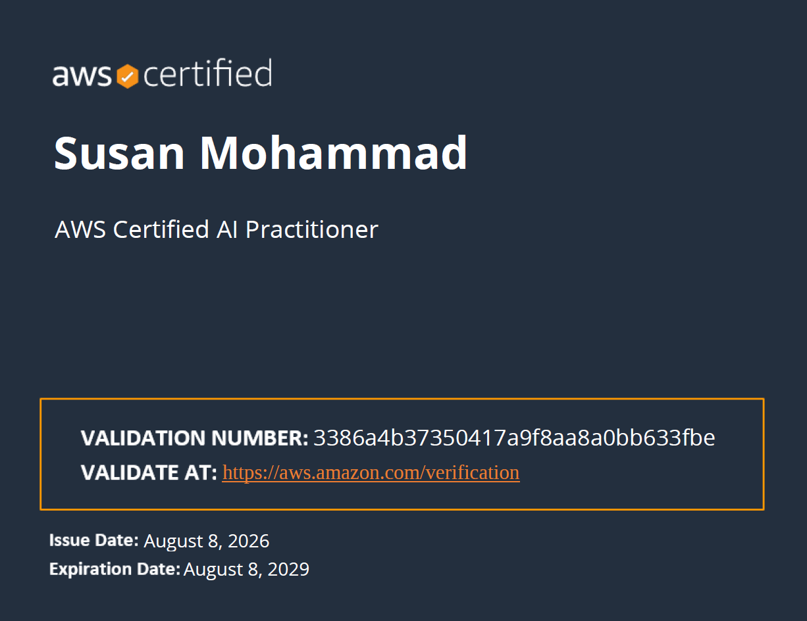

\`\`\`{=html}

:::::: hero
<canvas id="graph">

</canvas>

::::: hero-content
<h1>I turn process expertise into AI-powered systems.</h1>

::: role-line
[\|]{.cursor}
:::

<p class="bio">

<strong>7+ years</strong> driving process transformation, continuous improvement, and operational efficiency across tech and banking — cutting manual coordination effort by <strong>90%</strong> through workflow automation. Now building the ML models, LLM pipelines, and vector databases that solve complex business problems with code.

</p>

::: cta-row
<a class="btn primary" href="#featured-research">View Research</a> <a class="btn" href="#featured-apps">View Applications</a>
:::
:::::
::::::

<section id="featured-research">

::: section-label
Featured Research
:::

<h2>Legislative Text Analysis</h2>

:::::: {.project-card .featured-card}
::::: project-body
::: tags
[NLP]{.tag} [TF-IDF]{.tag} [LDA Topic Modeling]{.tag} [Wordfish Scaling]{.tag} [LLM Tagging]{.tag} [R]{.tag}
:::

<h3>Voting Bills Analysis Across Red, Blue & Purple States</h3>

<p>Political text mining project analyzing state-level voting legislation across the U.S. using Natural Language Processing and LLM classification. Parsed 83 legislative bills across partisan divides to uncover key policy themes and framing patterns. Evaluated automated tagging rigor with human-in-the-loop agreement (Cohen's κ = 0.831).</p>

::: project-links
<a href="voting-bills-analysis.qmd">Read Full Methodology & Code ↗</a> <a href="https://github.com/susanmohammadk22" target="_blank" rel="noopener noreferrer">GitHub Repo ↗</a>
:::
:::::
::::::

</section>

<section id="featured-apps">

::: section-label
Selected Work
:::

<h2>AI & Data Applications</h2>

::::::::::::::: projects-grid
:::::: project-card
::::: project-body
<h3>QIntel — Live Event Q&A Intelligence</h3>

<p>Real-time audience interaction system backed by an SQLite star-schema database pipeline. Automates question topic classification using LDA topic modeling and Quanteda, handles country identification with fuzzy Levenshtein distance matching (adist), and integrates live voice-to-text speech processing for event speakers.</p>

::: tags
[R + Shiny]{.tag} [SQLite]{.tag}
:::

::: project-links
<a href="https://qevent.shinyapps.io/qevent_app/" target="_blank" rel="noopener noreferrer">Live Demo ↗</a> 
<a href="Final-Project.pdf" target="_blank" rel="noopener noreferrer">Report ↗</a>
<a href="https://github.com/susanmohammadk22/QIntel-QnA-System" target="_blank" rel="noopener">GitHub Repo ↗</a>
:::
:::::
::::::

:::::: project-card
::::: project-body
<h3>Python Quiz App with AI Tutor</h3>

<p>Interactive assessment tool built with FastAPI and SQLite. Uses a local LLM (Ollama + DeepSeek-Coder) to provide plain-language explanations for wrong answers and dynamically generate new questions.</p>

::: tags
[FastAPI]{.tag} [Local LLM]{.tag} [SQLite]{.tag}
:::

::: project-links
<a href="https://python-quiz-app-tzkf.onrender.com/" target="_blank" rel="noopener noreferrer">Live Demo ↗</a> <a href="https://github.com/susanmohammadk22/Python-Quiz-App" target="_blank" rel="noopener noreferrer">GitHub ↗</a>
:::
:::::
::::::

:::::: {.project-card .full-width}
::::: project-body
<h3>Flight Delay Risk Prediction (DFW Airport Analysis)</h3>

<p>Predictive analytics pipeline built for the American Airlines / UTD Hackathon. Connects directly to live weather APIs via an ETL data pipeline, flagging high-risk airport pairs using Random Forest and Lasso regression models.</p>

::: tags
[R]{.tag} [Random Forest]{.tag} [Lasso Regression]{.tag} [ETL]{.tag}
:::

::: project-links
<a href="https://github.com/susanmohammadk22/airline-weather-risk-analysis" target="_blank" rel="noopener noreferrer">GitHub Repository & Code ↗</a>
:::
:::::
::::::
:::::::::::::::

</section>

<section>

::: section-label
Career
:::

<h2>Experience</h2>

::::::::::::::: exp-list
::::: exp-row
::: exp-meta
[Process Transformation Engineer]{.role}Comerica Bank<br>Feb 2025 – Present
:::

::: exp-body
<p>Mapped current- and future-state workflows. Designed a Power Platform automation (Power Apps, Power Automate, SharePoint) that <strong>cut manual coordination effort by 90%</strong>; now contributing in a Power BI data migration across merging banking systems.</p>
:::
:::::

::::: exp-row
::: exp-meta
[Continuous Improvement Expert]{.role}Snapp<br>Nov 2020 – Dec 2023
:::

::: exp-body
<p>Applied DMAIC and fishbone root-cause analysis to redesign customer onboarding end-to-end processes, <strong>cutting cycle time 65%</strong> and <strong>manual verification workload 60%</strong>.</p>
:::
:::::

::::: exp-row
::: exp-meta
[Process Excellence Expert]{.role}Hyper-Me<br>Jan 2018 – Nov 2020
:::

::: exp-body
<p>Mapped operational workflows, using root-cause analysis to prioritize improvement opportunities; drove <strong>20% immediate adoption</strong> on simplification and automation initiatives.</p>
:::
:::::

::::: exp-row
::: exp-meta
[Business Process Analyst]{.role}Shatel<br>Jun 2015 – Dec 2017
:::

::: exp-body
<p>Designed IVR call-flow architecture and a crisis-response routing system for high-volume customer communications; built change-management frameworks <strong>achieving 80% team adoption</strong>.</p>
:::
:::::
:::::::::::::::

</section>

<section id="certifications">

::: section-label
Credentials
:::

<h2>Certifications & Licenses</h2>

::::::::::::: projects-grid
<!-- AWS Certified AI Practitioner Card -->

::::::: {.project-card .cert-card}
::: cert-image-container
<a href="aws-ai-practitioner.pdf" target="_blank" rel="noopener noreferrer"> 
   
</a>
:::

::::: project-body
<h3>AWS Certified AI Practitioner</h3>

<p class="cert-issuer">

Amazon Web Services (AWS)

</p>

::: tags
[Generative AI]{.tag} [Machine Learning]{.tag} [AWS Cloud]{.tag}
:::

::: project-links
<a href="aws-ai-practitioner.pdf" target="_blank" rel="noopener noreferrer">View Original PDF ↗</a>
:::
:::::
:::::::

<!-- Lean Six Sigma Black Belt Card -->

::::::: {.project-card .cert-card}
::: cert-image-container
<a href="black-belt.pdf" target="_blank" rel="noopener noreferrer">  </a>
:::

::::: project-body
<h3>Lean Six Sigma Black Belt</h3>

<p class="cert-issuer">

Council for Six Sigma Certification (CSSC)

</p>

::: tags
[Process Excellence]{.tag} [DMAIC]{.tag}
:::

::: project-links
<a href="black-belt.pdf" target="_blank" rel="noopener noreferrer">View Original PDF ↗</a>
:::
:::::
:::::::

<!-- iGrafx Process Design Administration Card -->

::::::: {.project-card .cert-card}
::: cert-image-container
<a href="igrafx-cert.pdf" target="_blank" rel="noopener noreferrer">  </a>
:::

::::: project-body
<h3>Process Design Administration (Level 100)</h3>

<p class="cert-issuer">

iGrafx University · Process360 Live

</p>

::: tags
[Process Modeling]{.tag} [BPMN]{.tag} [Workflow Design]{.tag}
:::

::: project-links
<a href="igrafx-cert.pdf" target="_blank" rel="noopener noreferrer">View Original PDF ↗</a>
:::
:::::
:::::::
:::::::::::::

</section>

<section>

::: section-label
Toolkit
:::

<h2>Skills & Capabilities</h2>

:::::::::::::::: skills-grid
::: skill-chip
Python
:::

::: skill-chip
R
:::

::: skill-chip
SQL
:::

::: skill-chip
LLMs (Ollama)
:::

::: skill-chip
NLP / TF-IDF
:::

::: skill-chip
Random Forest
:::

::: skill-chip
Lasso Regression
:::

::: skill-chip
Shiny
:::

::: skill-chip
PostgreSQL
:::

::: skill-chip
SQLite
:::

::: skill-chip
Process Mapping
:::

::: skill-chip
Lean Six Sigma Black Belt
:::

::: skill-chip
Econometrics
:::
::::::::::::::::

</section>

```{=html}
<script>
const roles = ["Process Transformation Engineer", "AI & ML Builder", "Continuous Improvement Expert"];
const typedEl = document.getElementById('typed');
let r = 0, c = 0, deleting = false;

function tick(){
if (!typedEl) return;
const word = roles[r];
typedEl.textContent = deleting ? word.slice(0, c--) : word.slice(0, c++);
if(!deleting && c === word.length + 1){ deleting = true; setTimeout(tick, 1200); return; }
if(deleting && c === 0){ deleting = false; r = (r+1) % roles.length; }
setTimeout(tick, deleting ? 40 : 85);
}
tick();

const canvas = document.getElementById('graph');
if (canvas) {
const ctx = canvas.getContext('2d');
function resize(){
canvas.width = canvas.parentElement.offsetWidth;
canvas.height = canvas.parentElement.offsetHeight;
}
resize();
window.addEventListener('resize', resize);

const N = 40;
const pts = Array.from({length:N}, () => ({
x: Math.random()*canvas.width,
y: Math.random()*canvas.height,
vx: (Math.random()-0.5)*0.25,
vy: (Math.random()-0.5)*0.25
}));

function draw(){
ctx.clearRect(0, 0, canvas.width, canvas.height);

for(const p of pts){
p.x += p.vx;
p.y += p.vy;
if(p.x < 0 || p.x > canvas.width) p.vx *= -1;
if(p.y < 0 || p.y > canvas.height) p.vy *= -1;
}

for(let i = 0; i < N; i++){
for(let j = i + 1; j < N; j++){
const dx = pts[i].x - pts[j].x;
const dy = pts[i].y - pts[j].y;
const d = Math.sqrt(dx * dx + dy * dy);
if(d < 140){
ctx.strokeStyle = `rgba(45,212,191,${0.15 * (1 - d / 140)})`;
ctx.beginPath();
ctx.moveTo(pts[i].x, pts[i].y);
ctx.lineTo(pts[j].x, pts[j].y);
ctx.stroke();
}
}
}

for(const p of pts){
ctx.fillStyle = 'rgba(242,166,90,0.7)';
ctx.beginPath();
ctx.arc(p.x, p.y, 2, 0, Math.PI * 2);
ctx.fill();
}

requestAnimationFrame(draw);
}
draw();
}
</script>
```
